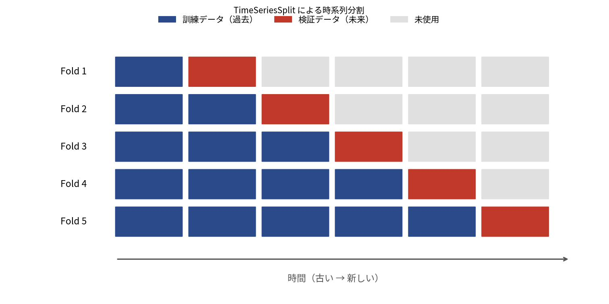
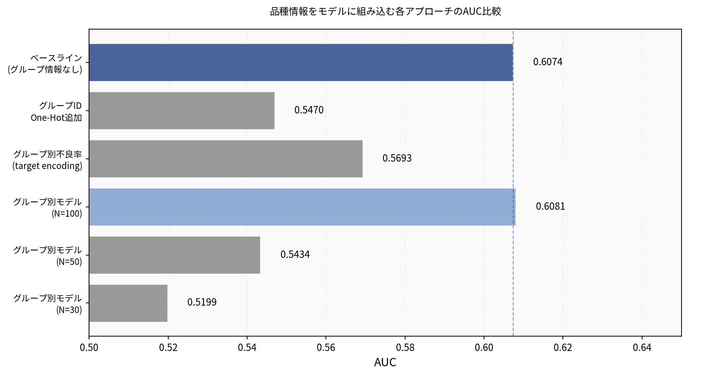
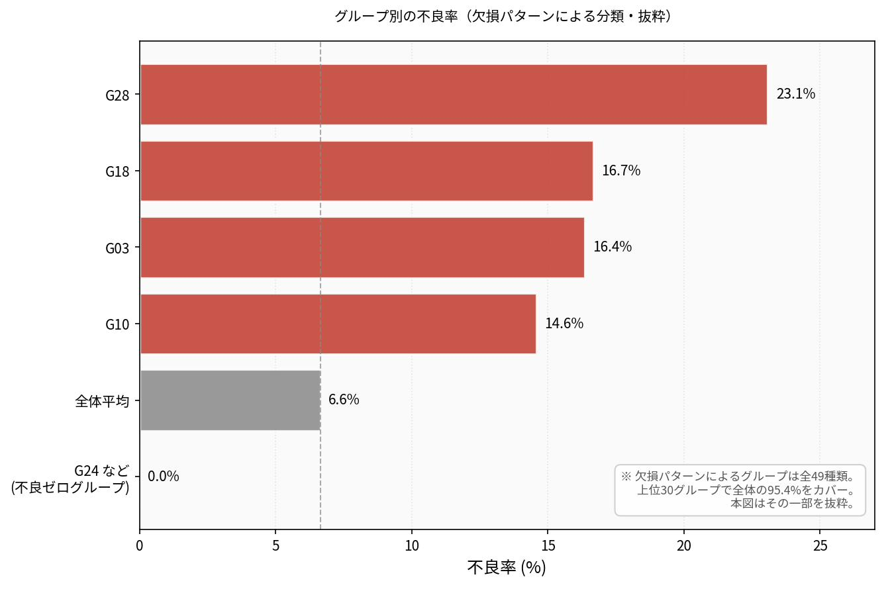
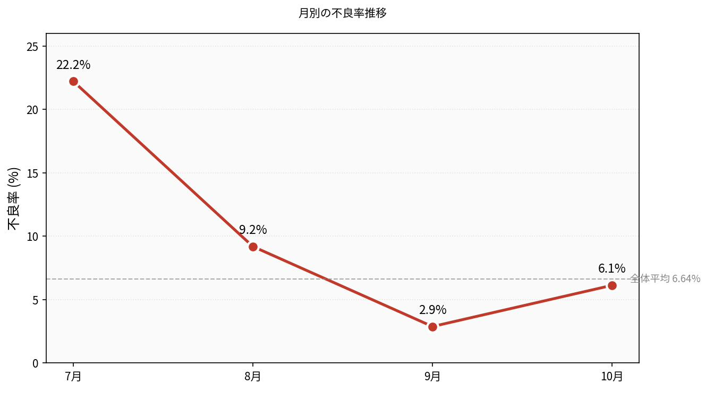
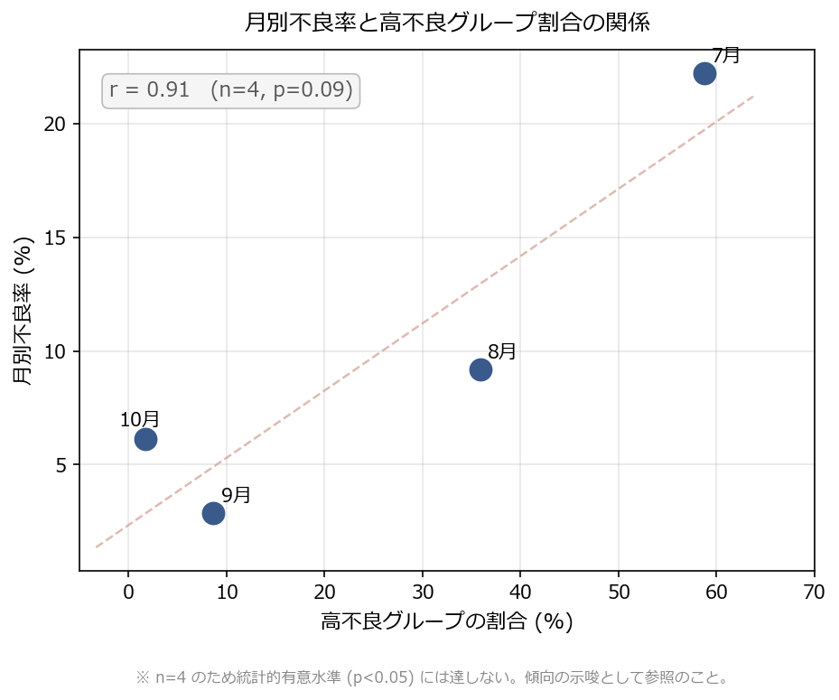
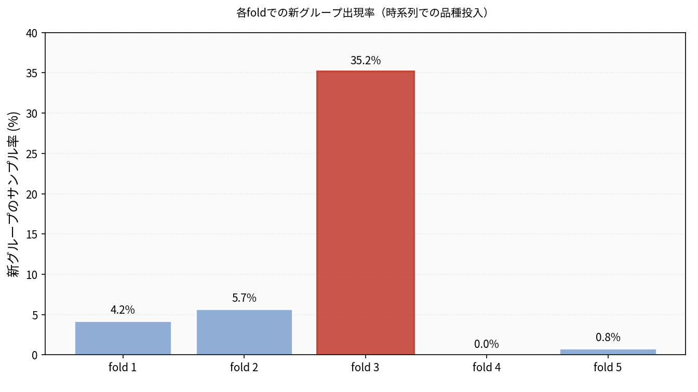

# SECOM 不良予測 ― データを読み解き、運用可能な形にするまで

半導体製造ラインのセンサーデータ（[UCI SECOM データセット](https://archive.ics.uci.edu/dataset/179/secom)）を題材に、**データリークを排除した厳密な分析**を行い、その結論を再現可能な推論サービス(FastAPI + Docker)としてまとめたプロジェクト。

元・電子部品メーカーの製造技術職（不良改善が専門）が、現場感覚とデータ分析を掛け合わせて「このデータが何を物語っているか」を読み解いた記録。

## 2 部構成

| 記事 | 主軸 | 記事ファイル | 対応するコード |
|------|------|------|------|
| **考察編**（Zenn: リンクは公開後に追記） | データをどう読むか。厳密な評価で何が分かったか | [`articles/secom-defect-analysis.md`](articles/secom-defect-analysis.md) | `notebooks/`, `reports/figures/` |
| **実装編**（Zenn: リンクは公開後に追記） | 分析結果をどう運用可能な形にするか。API 化・コンテナ化・再現性 | [`articles/secom-defect-serving.md`](articles/secom-defect-serving.md) | `src/`, `models/`, `Dockerfile` |

> 記事本体は [Zenn CLI](https://zenn.dev/zenn/articles/zenn-cli-guide) で管理している（`articles/` に Markdown、画像は `images/`）。執筆・公開の手順は[後述](#記事の執筆と公開zenn-cli)。

> 予測精度を競うプロジェクトではない。「精度に限界のあるモデルでも、誰でも同じ結果を再現できる状態にする」までの一連の流れを示すことが目的。

---

## 結果サマリー

| 項目 | 値 |
|------|------|
| データ | 1,567 サンプル × 590 センサー特徴量 |
| ラベル | 合格 1,463 / 不良 104（不良率 **6.64%**、強い不均衡） |
| 欠損 | 41,951 セル（全体の 4.54%） |
| 最良モデル | きちんとした前処理 + Random Forest |
| **厳密評価 AUC** | **0.6074**（Nested CV、リーク排除） |
| 厳密評価 PR-AUC | 0.1346（ベースライン 0.0664 の約 2 倍） |
| 前処理後の特徴量数 | 590 → 460（436 列 + 欠損フラグ 24 列） |

---

## 考察編のハイライト

### 1. リークを除くと AUC は 0.72 → 0.6074 に下がる

当初、特徴量選択でAUC 0.72が出て喜んだが、これは**全データで特徴量重要度を計算してから交差検証する**というデータリークが生んだ幻だった。特徴量選択を含む全処理を交差検証の内側で完結させる Nested CV と、時間順を守る `TimeSeriesSplit` で測り直すと、真の実力は **AUC 0.6074** だった。



凝った工夫ほど効かず、最良は「きちんとした前処理 + Random Forest」という最も地味な構成だった。



### 2. 欠損パターンから「品種ミックス」が見えた（最大の発見）

欠損は単なるデータの抜けではなく、**どの品種がどの工程を通った（あるいはバイパスした）か**を表している可能性がある。欠損率 10〜70% の 44 列の欠損パターンでサンプルを分類すると、ユニークなパターンはわずか 49 種類に収束し、グループごとの不良率は 0%〜23% と劇的に異なっていた。





さらに、月別不良率の大きな変動（7月 22% → 9月 3%）は、その月にどの品種が多く流れていたか（高不良グループの割合）と強い正の関係が見られた（r ≈ 0.91）。ただし月数は 4 ヶ月のみ（n=4, p≈0.09）であり、統計的有意水準には達しない。品種ミックス仮説を支持する材料として提示する。



### 3. 発見はモデル精度には繋げられなかった（失敗の記録）

「グループで不良率がこれだけ違うなら、グループ情報をモデルに教えれば精度が上がるはず」と考え、グループ ID の特徴量追加など複数の方法を試みたが、いずれもベースラインを超えられなかった。理由は 3 つ——(1) グループあたりのサンプル数が少なく安定した学習ができない、(2) 時系列評価では学習時に未知だったグループがテスト期に出現するドリフトが起きる、(3) そもそも欠損フラグにグループ情報がすでに含まれており新情報にならない——が重なった結果だった。「面白い発見」が必ず精度改善に結びつくとは限らない、という教訓が残った。



> 補足: 私の前職は電子部品（金属製品）製造であり、半導体ウエハ製造そのものの実務経験はない。品種ミックスの解釈は、製造業全般に共通する現場感覚からの推測であって断定ではない。

### 記事の章 ↔ コードの対応

| 記事の章 | 場所 |
|---------|------|
| 第2〜4章（前処理・Nested CV・パターン比較） | `notebooks/secom_strict_analysis.ipynb`（Step 2〜5）, `src/preprocessing.py` |
| 第5章（品種ミックス） | `notebooks/`（Step 6: 欠損パターン分析） |
| 第6章（月別不良率の正体） | `notebooks/`（Step 6 後半: 相関分析） |
| 第7章（品種情報をモデルに使えるか） | `notebooks/`（Step 7: 組み込み試行） |
| 図表 | `reports/figures/` |

---

## このリポジトリの技術的なポイント（実装編）

**学習済みの前処理クラスを、推論サーバーから安全に復元できるようにしている。**

`joblib.dump()` で保存した pickle には、クラス本体ではなく「クラスがどのモジュールに定義されているか」というパスだけが記録される。分析ノートブックの中で前処理クラスを定義したまま保存すると、そのパスは `__main__.SecomPreprocessor` になり、別プロセスである API からは復元できない。

そこで前処理クラスを [`src/preprocessing.py`](src/preprocessing.py) に切り出し、**学習スクリプトと API の双方が同じ `from src.preprocessing import SecomPreprocessor` で参照する**設計にした。これにより pickle のモジュールパスが一貫し、どこからでも `joblib.load()` で復元できる。

---

## ディレクトリ構成

```
secom-defect-prediction/
├── README.md
├── requirements.txt          # 学習・推論を再現するための固定バージョン
├── Dockerfile                # 推論 API のコンテナイメージ
├── docker-compose.yml        # ワンコマンド起動
├── sample_input.json         # API 動作確認用のサンプル（実データの不良行 1 件）
├── package.json              # Zenn CLI（記事のプレビュー・管理）
├── articles/                 # Zenn 記事本体（Markdown）
│   ├── secom-defect-analysis.md  # 考察編
│   └── secom-defect-serving.md   # 実装編
├── images/                   # Zenn 記事用の画像（/images/... で参照）
│   └── secom-defect-analysis/    # 考察編の図（fig1〜fig6）
├── src/
│   ├── preprocessing.py      # 前処理クラス（リーク防止 / 独立モジュール）
│   ├── train.py              # 最終モデルの学習と保存
│   └── api.py                # FastAPI 推論サーバー
├── models/                   # 学習済み preprocessor / model / metadata
├── data/                     # secom.data, secom_labels.data, secom.names（UCI 公式オリジナル）
├── notebooks/
│   └── secom_strict_analysis.ipynb  # 考察編の本体（厳密版の分析）
├── reports/
│   └── figures/              # 考察編の図表の生成元（fig1〜fig6）
├── scripts/
│   └── make_sample_input.py  # sample_input.json をデータから生成
├── tests/
│   └── test_api.py           # pytest による API テスト
└── .github/workflows/ci.yml  # 学習 → テストの CI
```

> `reports/figures/` は分析（ノートブック）が生成する図の置き場、`images/secom-defect-analysis/` は Zenn 記事が参照する同じ図のコピー。図を更新したら両方に反映する。

---

## 再現手順

```bash
# 1. 依存パッケージ
pip install -r requirements.txt

# 2. モデルの学習（models/ に学習済みがあるので任意。data/ から再生成する場合のみ）
python -m src.train

# 3. API 起動 → http://localhost:8000/docs を開く
uvicorn src.api:app --reload

# 4. 推論を試す（sample_input.json は実データの「不良だった行」）
curl -X POST http://localhost:8000/predict \
  -H "Content-Type: application/json" \
  -d @sample_input.json
# => {"defect_probability": 0.6597, "is_defect": true, "threshold": 0.5}

# 5. テスト
pytest -q
```

### ノートブックの再実行

`notebooks/secom_strict_analysis.ipynb` は `data/` を読み込んで分析・図表生成まで行える。コミット前は出力を消すと差分がきれいになる:

```bash
jupyter nbconvert --clear-output --inplace notebooks/secom_strict_analysis.ipynb
```

---

## 記事の執筆と公開（Zenn CLI）

記事は [Zenn CLI](https://zenn.dev/zenn/articles/zenn-cli-guide) で管理している。本文は `articles/<slug>.md`、画像は `images/` 配下に置き、記事からは `/images/...` の絶対パスで参照する。

```bash
# 依存（zenn-cli）のインストール
npm install

# ブラウザでプレビュー → http://localhost:8000
npm run preview

# 新しい記事を追加する場合
npm run new:article
```

| 記事 | slug | 公開状態 |
|------|------|------|
| 考察編 | `secom-defect-analysis` | `published: false`（下書き） |
| 実装編 | `secom-defect-serving` | `published: false`（下書き） |

公開するときは各記事の frontmatter を `published: true` に変更し、この GitHub リポジトリを [Zenn のデプロイ連携](https://zenn.dev/zenn/articles/connect-to-github)に接続して push する。`published_at` を指定すれば予約投稿もできる。

> 各記事は Notion で執筆・管理しており、確定版を `articles/` に反映している。`reports/figures/` の図を更新したときは `images/secom-defect-analysis/` 側にもコピーすること。

---

## Docker での起動

```bash
docker compose up --build
curl http://localhost:8000/health
```

イメージには `src/` と `models/` のみを含め、データ・ノートブック・図表は除外している（`.dockerignore`）。

---

## API エンドポイント

| メソッド | パス | 説明 |
|---------|------|------|
| GET | `/` | サービス概要 |
| GET | `/health` | ヘルスチェック |
| GET | `/metadata` | モデル・評価のメタデータ |
| POST | `/predict` | 1 件の推論（`features`: 590 個、欠損は `null` 可。`threshold` 任意） |
| POST | `/predict/batch` | 複数件の推論 |

---

## 運用上の位置づけ

この API は、製造現場における**推論サービスの中核**として組み込むことを想定している。検査工程での自動振り分け（不良確率の高い製品を優先検査へ）、日次・週次の品質モニタリング、現場ダッシュボードへの組み込みなど。あくまで**事後検知**だが、検査工数の削減・不良流出の防止・根本原因分析の入口として価値がある。モデルの実力には限界があるため、しきい値の調整や定期的な再学習・再評価を前提とした運用が必要。

---

## データセットについて

McCann, M. & Johnston, A. (2008). *SECOM* [Dataset]. UCI Machine Learning Repository.
公開データセットであり、研究・学習目的で利用できる。

`data/` の `secom.data` / `secom_labels.data` / `secom.names` は、[UCI Machine Learning Repository](https://archive.ics.uci.edu/dataset/179/secom) で配布されているオリジナルファイルをそのまま収録している。`secom.data` はスペース区切り、`secom_labels.data` はラベルと検査タイムスタンプ、`secom.names` はデータセットの説明文。
